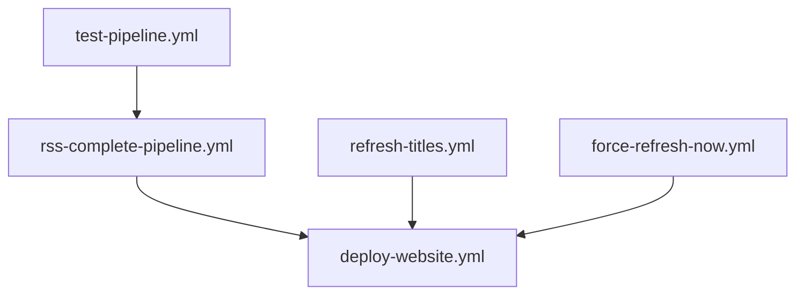

# GitHub Actions Workflows

This directory contains all GitHub Actions workflows for the RSS Analyzer project, organized by function.

## 🔄 Core Processing Workflows

### RSS Complete Pipeline (`rss-complete-pipeline.yml`)
- **Trigger**: Daily at 8:00 AM UTC + manual dispatch
- **Purpose**: Main production pipeline that fetches RSS feeds, processes articles, and updates the website
- **Features**: 
  - Full RSS analysis with configurable limits
  - AI-powered content processing
  - Website data generation and deployment
  - Database backup and artifact management

### Refresh Article Titles (`refresh-titles.yml`)
- **Trigger**: Manual dispatch only
- **Purpose**: Refreshes existing articles with improved title extraction
- **Use Case**: When title extraction logic is improved

### Force Refresh NOW (`force-refresh-now.yml`)
- **Trigger**: Manual dispatch only  
- **Purpose**: Immediate refresh of up to 45 articles with AI title extraction
- **Use Case**: Emergency updates or testing new AI features

## 🚀 Deployment Workflows

### Deploy Website (`deploy-website.yml`)
- **Trigger**: Push to main, PRs, manual dispatch
- **Purpose**: Deploys the static website to GitHub Pages
- **Features**: File validation and artifact upload

## 🧪 Testing Workflows

### Test Pipeline Components (`test-pipeline.yml`)
- **Trigger**: PRs, push to main, manual dispatch
- **Purpose**: Tests individual pipeline components before deployment
- **Test Levels**: basic, imports, full
- **Components**: RSS parsing, web scraping, database operations

## 🤖 AI Assistant Workflows

### Claude Code Assistant (`claude.yml`)
- **Trigger**: Comments containing `@claude`
- **Purpose**: Interactive AI assistance for issues and PRs

### Claude Code Review (`claude-code-review.yml`)
- **Trigger**: New PRs and updates
- **Purpose**: Automated code review with AI feedback

## Workflow Dependencies

## Configuration

All workflows use environment variables for configuration:

- `API_PROVIDER`: AI service provider (mistral, openai, anthropic)
- `MAX_ARTICLES_PER_RUN`: Limit for article processing
- `FOLLOW_LINKS`: Enable/disable link following in articles

## Secrets Required

- `MISTRAL_API_KEY`: For Mistral AI processing
- `OPENAI_API_KEY`: For OpenAI processing  
- `CLAUDE_CODE_OAUTH_TOKEN`: For Claude Code assistant

## Best Practices

1. **Test First**: Always run `test-pipeline.yml` before deploying changes
2. **Incremental Updates**: Use `refresh-titles.yml` for title improvements
3. **Emergency Updates**: Use `force-refresh-now.yml` sparingly
4. **Monitor Artifacts**: Check workflow artifacts for debugging