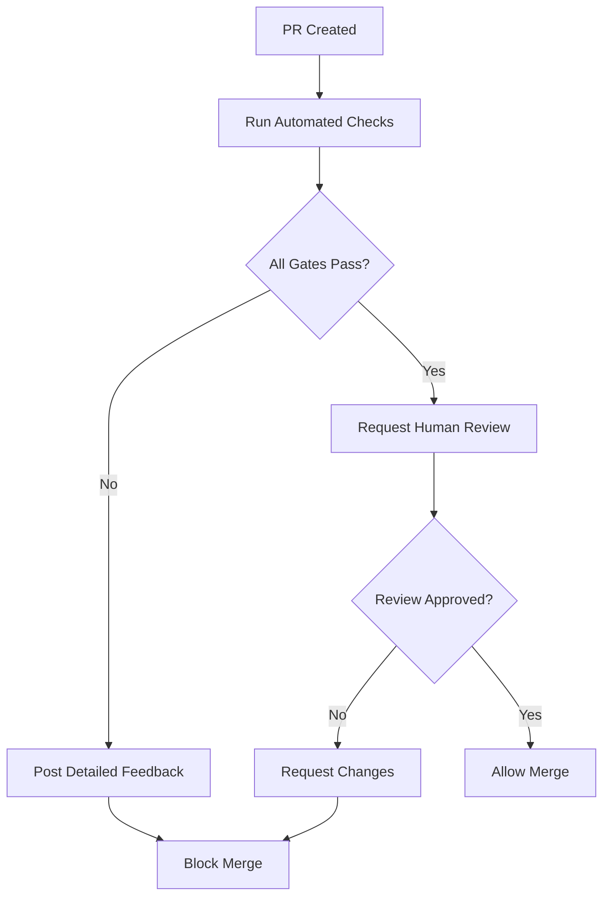

# Quality Gates and Merge Criteria

## Comprehensive quality gates for RSS Analyzer pull requests

This document defines the quality gates that must be passed before a pull request can be merged to the main branch.

---

## Overview

Quality gates ensure that all code changes meet minimum standards for:
- Code quality and style
- Security
- Performance
- Test coverage
- Documentation

Each gate is enforced automatically through CI/CD pipelines and prevents merging if criteria are not met.

---

## Gate 1: Code Quality

### Static Analysis Requirements

All static analysis checks must pass with no blocking errors:

| Tool | Requirement | Severity |
|------|-------------|----------|
| **Ruff** | 0 errors | Blocking |
| **Mypy** | 0 type errors | Blocking |
| **Pylint** | Score ≥ 8.0/10 | Blocking |

#### Ruff Checks
```yaml
Status: ✅ Must Pass
Errors Allowed: 0
Warnings Allowed: 5

Blocking Issues:
  - E999: Syntax errors
  - F821: Undefined names
  - F401: Unused imports (critical files only)
  - B008: Function calls in argument defaults
  - UP: Python upgrade syntax violations
```

#### Mypy Type Checking
```yaml
Status: ✅ Must Pass
Errors Allowed: 0
Strict Mode: true

Blocking Issues:
  - Missing type annotations on functions
  - Incompatible return types
  - Incompatible argument types
  - Missing return statements
  - Any type usage (without explicit Any)

Exemptions:
  - Third-party libraries without stubs (use # type: ignore[import])
```

#### Pylint Quality Score
```yaml
Status: ✅ Must Pass
Minimum Score: 8.0/10.0
Critical Issues: 0

Scoring Breakdown:
  - 10/10: Excellent code quality
  - 8-9/10: Good code quality (acceptable)
  - 6-7/10: Needs improvement (fails gate)
  - <6/10: Poor code quality (fails gate)

Critical Issues (always blocking):
  - Syntax errors
  - Undefined variables
  - Duplicate code > 100 lines
  - Complexity > 15
```

### Complexity Thresholds

```yaml
Cyclomatic Complexity:
  - Functions: ≤ 10
  - Classes: ≤ 15
  - Modules: ≤ 20

Cognitive Complexity:
  - Functions: ≤ 15
  - Critical paths: ≤ 10

Lines of Code:
  - Functions: ≤ 100
  - Classes: ≤ 500
  - Modules: ≤ 1000
```

### Enforcement

```bash
# Gate check command
./tools/check_quality_gate.sh code-quality

# Manual verification
ruff check . && mypy src/ && pylint src/ --score=y
```

---

## Gate 2: Security

### Security Scanning Requirements

All security scans must pass with no critical or high-severity issues:

| Scanner | Critical | High | Medium | Low |
|---------|----------|------|--------|-----|
| **Bandit** | 0 | 0 | ≤ 3 | ≤ 10 |
| **Safety** | 0 | 0 | ≤ 2 | Any |

#### Bandit Security Checks
```yaml
Status: ✅ Must Pass
Critical Issues: 0
High Issues: 0

Blocking Vulnerabilities:
  - Hardcoded passwords/API keys (B105, B106)
  - SQL injection risks (B608)
  - Shell injection (B602, B605)
  - Eval/exec usage (B307)
  - Insecure random (B311 for crypto)
  - XML vulnerabilities (B313-B320)
  - Insecure SSL/TLS (B501-B504)

Exemptions (with justification):
  - B303: MD5 for non-cryptographic hashing (content deduplication)
```

#### Dependency Vulnerabilities
```yaml
Status: ✅ Must Pass
Critical CVEs: 0
High CVEs: 0

Action Required:
  - Update vulnerable dependencies to patched versions
  - If no patch available, document risk and mitigation
  - Add security exception with expiration date
```

### Security Checklist

- [ ] No hardcoded secrets in code
- [ ] All secrets loaded from environment variables
- [ ] Parameterized database queries only
- [ ] Input validation on all user inputs
- [ ] HTTPS used for all external API calls
- [ ] Rate limiting implemented for API endpoints
- [ ] No eval() or exec() usage
- [ ] File path validation to prevent directory traversal
- [ ] Dependencies are up to date (within 6 months)

### Enforcement

```bash
# Gate check command
./tools/check_quality_gate.sh security

# Manual verification
bandit -r src/ -c .bandit && safety check --json
```

---

## Gate 3: Async Patterns

### Async/Await Validation

All async code must follow best practices:

| Check | Requirement | Severity |
|-------|-------------|----------|
| **Blocking I/O** | 0 instances | Blocking |
| **Connection Pool** | 100% usage | Blocking |
| **Cache Usage** | ≥ 90% coverage | Warning |

#### Blocking I/O Detection
```yaml
Status: ✅ Must Pass
Violations: 0

Forbidden Patterns in Async Functions:
  - requests.get/post (use aiohttp)
  - time.sleep() (use asyncio.sleep())
  - sqlite3.connect() (use async pool)
  - open() without aiofiles
  - urllib.request (use aiohttp)

Detection:
  - AST parsing of all async functions
  - Pattern matching for blocking calls
  - CI/CD automated check
```

#### Connection Pool Compliance
```yaml
Status: ✅ Must Pass
Direct Connections: 0

Requirements:
  - All database operations use db_manager.get_connection()
  - No sqlite3.connect() outside database.py
  - Connection context managers used
  - Proper connection cleanup

Exemptions:
  - database.py (pool implementation)
  - Migration scripts (with justification)
```

#### Cache Strategy Enforcement
```yaml
Status: ⚠️ Warning (not blocking)
Coverage Target: 90%

Requirements:
  - API calls check cache first
  - Expensive operations cached
  - Proper TTL configuration
  - Cache invalidation on updates

Coverage Calculation:
  cache_coverage = (cached_operations / total_expensive_operations) * 100
```

### Enforcement

```bash
# Gate check command
./tools/check_quality_gate.sh async-patterns

# Manual verification
python tools/check_async_patterns.py && python tools/check_pool_usage.py
```

---

## Gate 4: Test Coverage

### Coverage Requirements

Test coverage must meet minimum thresholds:

| Metric | Minimum | Target | Ideal |
|--------|---------|--------|-------|
| **Overall** | 80% | 85% | 90% |
| **New Code** | 90% | 95% | 100% |
| **Critical Paths** | 100% | 100% | 100% |

#### Coverage Tiers
```yaml
Critical Paths (100% required):
  - src/core/database.py
  - src/ai_clients/*.py
  - src/core/cache.py
  - src/core/async_scraper.py

Core Functionality (90% required):
  - src/main.py
  - src/etl_orchestrator.py
  - src/rss_parser.py

Supporting Code (80% required):
  - src/core/monitoring.py
  - src/core/report_generator.py
  - tools/*.py
```

#### Test Quality Requirements
```yaml
Test Suite Requirements:
  - Unit tests for all public functions
  - Integration tests for workflows
  - Async tests with pytest-asyncio
  - Mock external dependencies
  - Error scenario coverage

Test Performance:
  - All tests complete in < 60s
  - Unit tests < 1s each
  - Integration tests < 10s each
  - No flaky tests (99.9% reliability)
```

### Coverage Calculation

```python
# Overall coverage
total_coverage = (covered_lines / total_lines) * 100

# New code coverage (PR diff)
new_code_coverage = (covered_new_lines / total_new_lines) * 100

# Critical path coverage
critical_coverage = (covered_critical_lines / total_critical_lines) * 100
```

### Enforcement

```bash
# Gate check command
./tools/check_quality_gate.sh test-coverage

# Manual verification
pytest --cov=src --cov-report=term --cov-report=json
```

---

## Gate 5: Documentation

### Documentation Requirements

All code changes must be properly documented:

| Element | Requirement | Severity |
|---------|-------------|----------|
| **Docstrings** | 100% public functions | Blocking |
| **Type Hints** | 100% signatures | Blocking |
| **README Updates** | If API changes | Blocking |
| **CHANGELOG** | All changes | Warning |

#### Docstring Standards
```yaml
Status: ✅ Must Pass
Missing Docstrings: 0 (public functions)

Required Sections:
  - Brief description (one line)
  - Detailed explanation (if complex)
  - Args: All parameters with types and descriptions
  - Returns: Return value type and description
  - Raises: All possible exceptions
  - Examples: For complex functions

Format: Google-style or NumPy-style (consistent)

Example:
  """
  Process articles concurrently using async patterns.

  This function implements bounded concurrency with semaphores to prevent
  resource exhaustion while maximizing throughput.

  Args:
      articles: List of article dictionaries with 'url' and 'title' keys
      max_concurrent: Maximum number of concurrent processing tasks (default: 8)

  Returns:
      List of analysis results, with None for failed analyses

  Raises:
      ValueError: If articles list is empty
      RuntimeError: If all articles fail to process

  Example:
      >>> articles = [{"url": "...", "title": "..."}]
      >>> results = await process_articles(articles, max_concurrent=5)
      >>> print(len([r for r in results if r is not None]))
      5
  """
```

#### Type Hint Requirements
```yaml
Status: ✅ Must Pass
Missing Type Hints: 0

Requirements:
  - All function parameters annotated
  - All return types annotated
  - Generic types fully specified (List[str], Dict[str, Any])
  - Optional types for nullable values
  - No bare Any without justification

Exemptions:
  - *args and **kwargs (with comment)
  - Decorators (use ParamSpec)
```

#### Documentation Updates
```yaml
Required Updates for:
  - New features: README.md, relevant docs/*.md
  - API changes: API_DOCUMENTATION.md
  - Configuration: CLAUDE.md, config/config.yaml
  - Breaking changes: CHANGELOG.md, MIGRATION.md
  - Performance: OPTIMIZATION_RESULTS.md

Update Validation:
  - Automated check for common files
  - Manual review of documentation quality
  - Link validation in CI/CD
```

### Enforcement

```bash
# Gate check command
./tools/check_quality_gate.sh documentation

# Manual verification
python tools/check_documentation.py
```

---

## Gate 6: Performance

### Performance Requirements

Changes must not degrade performance:

| Metric | Requirement | Severity |
|--------|-------------|----------|
| **Regression** | ≤ 5% | Blocking |
| **Memory** | ≤ +10% | Warning |
| **Response Time** | ≤ +10% | Warning |

#### Performance Benchmarks
```yaml
Key Metrics:
  - Article processing time (articles/second)
  - Database operations (queries/second)
  - Cache hit rate (%)
  - Memory usage (MB)
  - API response time (ms)

Baseline (Week 2 Optimized):
  - Processing: 12-16x faster than sync
  - Concurrency: 6-8 articles simultaneous
  - Cache hit rate: 72%
  - Memory usage: 300-350MB
  - API latency: <2s average

Regression Threshold:
  - Processing: ≤ 5% slower
  - Memory: ≤ +10%
  - Cache: ≥ 70% hit rate
```

#### Performance Testing
```yaml
Automated Benchmarks:
  - Run before and after changes
  - Compare against baseline
  - Flag regressions automatically

Test Scenarios:
  - 10 articles (quick test)
  - 50 articles (standard load)
  - 100 articles (stress test)

Metrics Collection:
  - Processing duration
  - Memory peak
  - API call count
  - Cache statistics
  - Error rate
```

### Enforcement

```bash
# Gate check command
./tools/check_quality_gate.sh performance

# Manual verification
python tools/performance_benchmark.py --compare-baseline
```

---

## Gate 7: Code Review

### Human Review Requirements

All PRs require human review before merge:

| Requirement | Minimum | Ideal |
|-------------|---------|-------|
| **Reviewers** | 1 | 2 |
| **Approval** | 1 maintainer | 2 maintainers |
| **Review Depth** | Standard | Thorough |

#### Review Checklist
```yaml
Code Review Must Verify:
  - [ ] Code follows project conventions
  - [ ] Logic is sound and well-structured
  - [ ] Error handling is appropriate
  - [ ] Security considerations addressed
  - [ ] Performance implications understood
  - [ ] Tests are comprehensive
  - [ ] Documentation is clear and accurate
  - [ ] No obvious bugs or issues

Priority Reviews:
  - Critical files: 2+ reviewers
  - Security changes: Security expert review
  - Performance changes: Performance review
  - API changes: API design review
```

#### Review Standards
```yaml
Review Depth Levels:

Standard (default):
  - Check automated results
  - Review changed lines
  - Verify tests pass
  - Approve if no issues

Thorough (complex changes):
  - Review all context
  - Check for side effects
  - Verify edge cases
  - Request improvements

Comprehensive (critical changes):
  - Full file review
  - Architecture assessment
  - Security audit
  - Performance analysis
  - Multiple reviewer approval
```

### Enforcement

```yaml
GitHub Branch Protection:
  - Require 1+ approvals
  - Require status checks to pass
  - Require conversation resolution
  - Dismiss stale reviews on new commits

Auto-Assignment:
  - Code owners for their domains
  - Security team for security changes
  - Performance team for optimization changes
```

---

## Quality Gate Workflow

### Automatic Checks (CI/CD)



### Gate Execution Order

```yaml
Phase 1: Fast Checks (< 1 min)
  1. Ruff linting
  2. Ruff formatting
  3. Async pattern validation

Phase 2: Analysis (< 3 min)
  4. Mypy type checking
  5. Pylint quality analysis
  6. Connection pool validation

Phase 3: Security (< 2 min)
  7. Bandit security scan
  8. Safety dependency check

Phase 4: Testing (< 5 min)
  9. Unit tests
  10. Integration tests
  11. Coverage analysis

Phase 5: Documentation (< 1 min)
  12. Docstring validation
  13. Type hint verification
  14. Update detection

Phase 6: Performance (< 5 min)
  15. Benchmark comparison
  16. Memory profiling
  17. Regression detection

Total: ~17 minutes for complete validation
```

### Override Procedures

#### Emergency Fixes

```yaml
Scenario: Critical production bug requiring immediate fix

Process:
  1. Create hotfix branch from main
  2. Implement minimal fix
  3. Run fast checks only (Phase 1-2)
  4. Get expedited review from 2+ maintainers
  5. Merge with --no-verify flag
  6. Create follow-up PR for full validation
  7. Add incident post-mortem

Requirements:
  - Document reason for override
  - Severity level: P0 (critical production down)
  - Approval: 2+ senior maintainers
  - Follow-up PR: Within 24 hours
```

#### Experimental Features

```yaml
Scenario: Experimental feature behind feature flag

Process:
  1. All automated gates must still pass
  2. Mark PR with "experimental" label
  3. Feature flag must be off by default
  4. Documentation must note experimental status
  5. Full validation before enabling

Exemptions:
  - Performance gate (can regress if flagged off)
  - Coverage gate (relaxed to 70% for experimental)
```

---

## Gate Status Dashboard

### GitHub Actions Status

All gates are visible in GitHub Actions:

```yaml
✅ Code Quality        (Ruff, Mypy, Pylint)
✅ Security           (Bandit, Safety)
✅ Async Patterns     (Custom validators)
✅ Test Coverage      (Pytest, 87.5%)
✅ Documentation      (Docstrings, Type hints)
⚠️ Performance        (No regression detected)
⏳ Code Review        (Awaiting approval)
```

### Quality Score

Overall quality score combines all gates:

```python
quality_score = (
    ruff_pass * 15 +
    mypy_pass * 15 +
    pylint_score +
    security_pass * 20 +
    async_pass * 10 +
    coverage_pct * 0.2 +
    docs_pass * 10 +
    performance_pass * 10
) / 100

# Score ranges:
# 90-100: Excellent (auto-approve eligible)
# 80-89: Good (standard approval)
# 70-79: Acceptable (thorough review required)
# <70: Needs improvement (changes requested)
```

---

## Troubleshooting Gate Failures

### Common Failures and Solutions

#### Gate 1: Code Quality Failure

```bash
# Issue: Ruff errors
ruff check . --fix  # Auto-fix issues
ruff format .       # Format code

# Issue: Mypy errors
mypy src/ --show-error-codes  # See specific errors
# Add type hints to resolve

# Issue: Pylint score < 8.0
pylint src/ --score=y -r y  # See detailed report
# Refactor complex functions, add docstrings
```

#### Gate 2: Security Failure

```bash
# Issue: Hardcoded secrets
# Move to environment variables
export ANTHROPIC_API_KEY="sk-..."

# Issue: SQL injection risk
# Use parameterized queries
cursor.execute("SELECT * FROM articles WHERE id = ?", (article_id,))

# Issue: Vulnerable dependency
pip install --upgrade <package>
```

#### Gate 4: Coverage Failure

```bash
# Issue: Coverage < 80%
pytest --cov=src --cov-report=html
# Open htmlcov/index.html
# Add tests for uncovered lines
```

---

## Maintenance

### Regular Reviews

Quality gates should be reviewed quarterly:

```yaml
Review Schedule:
  - Thresholds: Every 3 months
  - Tools: Every 6 months
  - Process: Every 12 months

Review Criteria:
  - Are thresholds still appropriate?
  - Are tools up to date?
  - Are exemptions still valid?
  - Is the process effective?
```

### Metrics to Track

```yaml
Gate Effectiveness:
  - False positive rate
  - False negative rate
  - Developer satisfaction
  - Time to merge
  - Defect escape rate

Process Improvements:
  - Reduce validation time
  - Improve feedback quality
  - Automate more checks
  - Better documentation
```

---

## Resources

- [Code Review Checklist](./REVIEW_CHECKLIST.md)
- [Automated Checks](./AUTOMATED_CHECKS.md)
- [Review Bot Configuration](./REVIEW_BOT_TEMPLATES.md)
- [GitHub Actions Workflows](../../.github/workflows/)

---

## Summary

All 7 quality gates must pass for PR approval:

1. ✅ **Code Quality**: Ruff + Mypy + Pylint (score ≥ 8.0)
2. ✅ **Security**: Bandit + Safety (0 critical/high)
3. ✅ **Async Patterns**: No blocking I/O, connection pool usage
4. ✅ **Test Coverage**: ≥ 80% overall, ≥ 90% new code
5. ✅ **Documentation**: 100% docstrings + type hints
6. ⚠️ **Performance**: ≤ 5% regression
7. 👤 **Code Review**: 1+ maintainer approval

**Total Gate Validation Time**: ~17 minutes

**Override**: Only for P0 production incidents with 2+ senior maintainer approval
