# Architecture Optimization - Visual Diagrams

This document contains visual representations of the current and optimized architectures using Mermaid diagrams.

---

## Current Architecture

### System Overview


### Current Sequential Processing Flow

```mermaid
sequenceDiagram
    participant User
    participant CLI
    participant Processor
    participant RSS
    participant Scraper
    participant AI
    participant DB

    User->>CLI: run --limit 10
    CLI->>Processor: Initialize

    loop For each article (sequential)
        Processor->>RSS: Fetch RSS entry
        RSS-->>Processor: Entry data
        Note over Processor: Wait 200ms

        Processor->>Scraper: Scrape content
        Note over Scraper: HTTP request + parsing
        Scraper-->>Processor: Content (2-3s)
        Note over Processor: Wait 2-3s

        Processor->>AI: Analyze content
        Note over AI: API call + rate limit
        AI-->>Processor: Analysis (3-5s)
        Note over Processor: Wait 3-5s

        Processor->>DB: Insert article
        DB-->>Processor: Article ID
        Processor->>DB: Insert content
        Processor->>DB: Update status
        Processor->>DB: Log processing
        Note over Processor: 4 DB operations
    end

    Processor->>CLI: Results
    CLI->>User: Display report

    Note over User,DB: Total: 8.3s per article × 10 = 83s
```



### Current Performance Bottleneck Analysis


---

## Optimized Architecture (After Implementation)

### Phase 1: Caching + Database Optimization


### Phase 2: Async/Await Processing Flow


### Caching Layer Architecture


---

## Performance Comparison

### Processing Time Comparison

```mermaid
gantt
    title Article Processing Time Comparison
    dateFormat X
    axisFormat %Ls

    section Current Sequential
    Article 1 :0, 8300ms
    Article 2 :8300ms, 8300ms
    Article 3 :16600ms, 8300ms

    section Optimized Async (5 concurrent)
    Article 1 :0, 8300ms
    Article 2 :0, 8300ms
    Article 3 :0, 8300ms
    Article 4 :8300ms, 8300ms
    Article 5 :8300ms, 8300ms
    Article 6 :8300ms, 8300ms
```

### Throughput Improvement


### Cost Reduction


---

## Database Optimization

### Current: Individual Operations


### Optimized: Batch Operations with Connection Pool


### Connection Pool Architecture


---

## Async/Await Execution Flow

### CPU Utilization Comparison

```mermaid
gantt
    title CPU Utilization Over Time
    dateFormat X
    axisFormat %Ls

    section Current (Sequential)
    CPU Active   :active, 0, 500ms
    Waiting I/O  :crit, 500ms, 7800ms
    CPU Active   :active, 8300ms, 500ms
    Waiting I/O  :crit, 8800ms, 7800ms

    section Optimized (Async 5x)
    CPU 1 Active :active, 0, 500ms
    CPU 2 Active :active, 0, 500ms
    CPU 3 Active :active, 0, 500ms
    CPU 4 Active :active, 0, 500ms
    CPU 5 Active :active, 0, 500ms
    Waiting I/O  :crit, 500ms, 3000ms
```

### Concurrency Control with Semaphore


---

## Implementation Phases

### Phase 1: Quick Wins (2 weeks)


### Phase 2: Async Pipeline (4 weeks)


### Phase 3: Code Consolidation (1 week)


---

## Scalability Roadmap

### Current vs Future Scaling


---

## Key Metrics Dashboard

### Expected Improvements Summary


---

## Legend

- 🔴 **Red/Pink** - Current issues, bottlenecks, problems
- 🟡 **Yellow/Gold** - Work in progress, medium priority
- 🟢 **Green** - Optimized, implemented, success
- 🔵 **Blue** - Database, storage, persistence
- ⚪ **Gray** - Future enhancements, optional

---

**Document Status:** ✅ Complete
**Last Updated:** 2025-10-12
**Version:** 1.0
